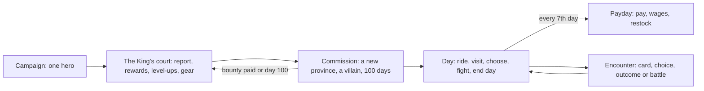
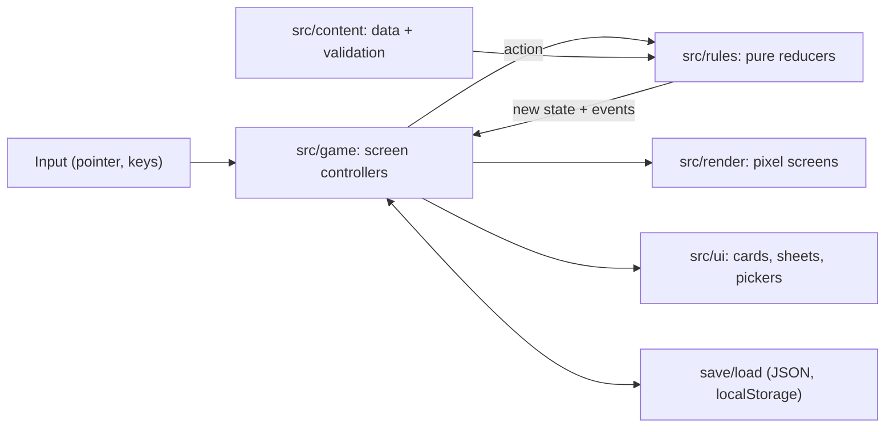

# King's Commission: plan

How the game fits together, how the code is structured, how every part gets tested, and the milestones. Read with `BRIEF.md`.

## Decided (with Artur, 25 Sep 2026)

- **Campaign:** one hero across a campaign. Levels, skills and gear carry over, and each commission is a new province.
- **Battles:** HoMM2-style. A hex battlefield where stacks take turns, and the hero casts spells and uses skills. Auto-resolve runs the same battle engine, so both give the same results.
- **RPG depth, in this order:** build choices first (a background, then skills and perks as you level), then story choices with reputation, then captains with quests and loyalty.
- **Keep from the prototype:** the 2D HoMM2 look, parchment cards instead of panels, the thin bottom bar, restrained fog, click-to-ride with daily movement, and the warm, dry voice.

## The loops

- **Campaign (many sessions):** you pick a background once, and the hero grows from commission to commission. A light story runs quietly through the court scenes.
- **Commission (20–30 min):** the first milestones use one villain, as now. The later shape, from the brief, is 2–3 villains. Each gives a bounty and a torn piece of the map, and the pieces point to where to dig for the commission's prize. Failing at day 100 costs the reward and the King's favour, but the campaign goes on.
- **Day:** a movement allowance that depends on the hero and the army. You visit places, make choices, fight, then end the day.

## Systems

**Hero (build choices first)**
- **Backgrounds**, each with its own stats, a signature perk and extra dialogue options:
  - Knight: leadership, and a Rally skill in battle.
  - Hedge Wizard: spell power, and starts with three spells.
  - Ranger: more movement, sees further through fog, stronger archers.
  - Courtier: cheaper recruits, bigger paydays, can talk or bribe.
- **Stats:** Attack, Defence, Spell Power, Knowledge (mana), Leadership (army size, as in King's Bounty).
- **Levels:** XP comes from battles, discoveries and contracts. Each level you pick one of three offered skills or perks.
  - Skills have ranks: Tactics, Archery, Logistics, Diplomacy, Scouting, Estates, and the magic schools.
  - Perks bend the rules, in the game's voice: *Quartermaster: wages cost a fifth less. The troops have noticed.*
- **Gear:** artifacts in slots (weapon, armour, helm, banner, two trinkets), found in chests, lairs and rewards.
- **Spells:** most are for battle. A few work on the map, such as Scry to lift fog, or recall to the castle.

**Army**
- Troops are just numbers. Up to five stacks, capped by leadership.
- Dwellings recruit, payday takes wages, and morale drops when the army mixes troops that dislike each other.
- Captains come later: rare notable creatures that join with a small group and a quirk.

**Adventure map**
- The current renderer stays. Provinces get assembled from hand-made set pieces (castle, village, ruin, mine, lair) placed on generated land, which keeps the hand-painted feel while every run differs.
- Map objects: dwellings, mines (weekly gold), shrines (spells), taverns (rumours), treasure, obstacles, wandering stacks and villain lairs.

**Battles**
- An 11 × 9 hex field with obstacles. Each stack has a count, health per troop, attack, defence, damage, speed and abilities (ranged, flying, no retaliation, and so on).
- Turn order follows speed. A stack can move, attack, shoot, wait or defend. The hero casts one spell per round, and skills change the numbers.
- The AI scores the options it can reach: who is the biggest threat, who can it finish off, and archers keep their distance.
- Target: a fight takes 2–5 minutes and reads clearly. Pixel sprites with counts, a hit flash, a lunge and damage numbers are enough.

**Story and content**
- All content is data: villains (name, gimmick, lair, army, lines), places, events, perks, artifacts, spells and troops, each with a typed definition.
- The voice follows `sketches/2d-map-mockup/` and the current cards: short, warm and dry.
- Portraits come later. Until then, cards use heraldic crests.

## Architecture

- **`src/rules/`:** no DOM, no timers, dice from a seed in the state. Every change is `(state, action) → { state, events }`. Events such as "gold gained", "stack killed" or "level up" drive cards and animations, so the render layer never guesses.
  - Modules: `campaign/`, `commission/`, `map/` (walk grid, pathfinding, visits, movement), `army/`, `battle/` (hex grid, turn engine, AI, auto-resolve), `hero/` (stats, XP, skills, perks, gear).
- **Logic before paint.** The rules own the logical map (a cost grid plus objects), built from the map definition or the generator. The painter draws that map. Right now the walk grid is read back from painted pixels. Flipping this lets bots play without a browser.
- **`src/content/`:** typed data files, plus checks that ids are unique and every reference resolves.
- **`src/render/`:** the adventure screen as it is now, a new battle screen, and shared palette, bitmap, sprites, text and effects. Battle for Wesnoth's units come in through `units.ts` (which unit and frames each troop uses) and `wesnoth.ts` (team colour, scaling and the palette).
- **`src/ui/`:** HTML/CSS overlays. Cards, the level-up picker, the hero sheet, the army screen, the battle bar and the court screen.
- **`src/game/`:** the glue. A controller per screen (adventure, battle, court), input, save/load and transitions. `main.ts` becomes a few lines.

## Testing: how I check my own work

| Layer | What it proves | Command |
| --- | --- | --- |
| Rules unit tests | Every reducer and invariant: leadership caps, no negative gold, the same seed gives the same result | `npm test` |
| Battle scenarios | Hand-built fights give the expected outcomes, and the AI makes sane choices | `npm test` |
| Content checks | Ids unique, references resolve, text within length limits | `npm test` |
| Map generation | For 200 seeds: every place reachable, nothing overlaps, the lair reachable, gold and threat within budget | `npm test` |
| Bot play-throughs | A simple bot plays whole commissions headless in milliseconds, and reports days to win, gold curve, losses and dead ends | `npm run sim` |
| Browser play-throughs | Scripted clicks through the real UI on every screen (like `scripts/win.mjs` today) | `npm run e2e` |
| Visual checks | Seeded scenes screenshotted and compared pixel by pixel with baselines you approved. The indexed renderer is exact, so diffs are clean | `npm run visual` |
| Your playtest | Each milestone ends with you playing a build. We note what's fun, what's boring and what's confusing | side panel |

The bot and the balance sims answer "does the pacing work?" before you play. Only your playtest answers "is it fun?"

## Milestones

Each milestone ends with tests green, screenshots in the side panel, and a playtest.

| # | Milestone | Done when |
| --- | --- | --- |
| M0 | **Restructure.** Reducers with events, `src/game` controllers, the logical map in rules, save/load, the bot runner, e2e and visual baselines. No new features. | Today's loop plays the same, all test layers run, and `main.ts` is small. |
| M1 | **Battles v1.** Hex field, 4–5 troop types, the turn engine, AI, 3 hero spells, the battle screen, and auto-resolve through the same engine. | The patrol, wolves and hideout are real fights of 2–4 minutes, and balance sims look sane. |
| M2 | **Hero builds.** 4 backgrounds, XP and levels, stats, a 3-way pick of 12–16 skills and perks, 10 artifacts, and the hero sheet. | Two play-throughs with different backgrounds feel different. |
| M3 | **Campaign shell.** The court between commissions, carry-over, the commission briefing, a second hand-made province, and saves. | Commission I, then the court, then Commission II, with the hero carried over. |
| M4 | **Generated provinces and villains.** Set-piece generation, 3 villains with gimmicks, map pieces and the dig for the prize. | 200 seeds valid, the bot finishes them, and you find them varied. |
| M5 | **Story choices and captains.** Dialogue options gated by background and skills, reputation, and 2–3 captains with quirks. | Choices change outcomes you can notice. |
| M6 | **Polish.** Animation, portraits, sound, then music. | Later. |

**Progress:** M0 to M4 are done: generated provinces for commissions III to V, two recurring villains, map pieces and the dig for the sceptre. Parleys are a first taste of M5. Next: captains, story choices at places other than enemies, then polish (M6). The polish rounds below came first, after Artur's playtests (27 and 28 Sep).

## Polish rounds (from 27 Sep)

Artur played the live build and found it lacking: no vibe or music, sprites at different scales, combat that's
trivial and then a wall, dull rewards, and playstyles that differ only in numbers. `docs/PLAYTEST.md` holds the
full critique. Each round ends with a playtest, a deploy and a new entry in that log.

| # | Round | Done when |
| --- | --- | --- |
| R1 | **Vibe.** Music and ambience in code, a title screen, an intro at court, portraits. | The first minute has a mood, and a reason to care. **Done:** five tracks and three ambiences, the painted title, the King's prologue with a WANTED poster and a choice of four faces, portraits on cards, and the province's name on a ribbon with a fanfare. |
| R2 | **Scale and juice.** A scale bible, one creature per map enemy, bigger fighters, feedback for every action. | Screenshots read at a glance, and nothing happens silently. **Mostly done:** rising gains, level glow, dust and glitter, nightfall; in battle, commanders and standards, sparks, shake, corpses, kill counts, breathing and the end ribbon. Melee winds up, lunges, knocks the target back and sprays blood, and counts drop as each blow lands (28 Sep). Since 28 Sep the troops and the hero are Battle for Wesnoth's units, on one scale, in team colours, with Wesnoth's own attack, defend, idle and death frames: the flash, the numbers, the sound and the jolt come on the frame where the blow lands. The hero is his background's figure: the Knight on horseback, the Wizard, Ranger and Courtier on foot. Still to do: cards that unfold, custom cursors, a fuller battlefield. |
| R3 | **Gating and rewards.** Small fights first, the patrol as a gate, honest odds, rewards that matter. | You explore before you fight, and every fight pays in something you can feel. **Started:** six relics that carry the heroes' tricks, Fireball and Stone Skin, the wolves' cloak and pelt, relic gatekeepers and charm shrines in generated provinces. Since 28 Sep, enemies can't be waited out, Aldmoor Butts replaces lost archers, and every find (towers, mines, mills, shrines, in every province) is a choice between a relic, a spell, troops, gold, a secret or a shortcut, some of which come back later. Since 28 Sep the level-up skills change how you play too: Advanced and Expert ranks teach a trick (stakes, charges, cheaper riding off the road, scouts who put numbers on the odds, rents, volunteers, mana while riding), and Diplomacy is new. **Next:** gear with character, perks that bend rules, and a spellbook worth filling. Then a slower experience curve. |
| R4 | **Playstyles.** Each background's own mechanics, and several paths past every enemy. | Two runs with different backgrounds play differently. **Started:** the knight's charge (no strike-back), the ranger's forest paths, opening volley and tamed beasts, the wizard's two casts a round and Far Sight, the courtier's half-price bribes and hired bands. Since 28 Sep, seven trick perks teach any hero another's trick, and every level offers one; the Hawthorn Crown and Beast Friend teach taming. |
| R5 | **RPG.** Quests with choices, captains, more troops. | Choices you make come back later. **Started:** in Aldmoor, spared poachers show their cache, their venison gets you past the wolves, the highwaymen's orders send the patrol to Grimsby, and the wolves' pelt buys Fireball from Old Nan. Since 28 Sep, finds come back too: Pike's journal sends the patrol home, the goose lures Grimsby's crossbowmen away, Anselm's letter thins the witch's goblins, a generated tower's note gives the villain's weakness, and two shortcuts (the dwarf's delving, the cutters' punt) slip past a gate. Still to do: captains, more troops, story that lasts beyond one commission. |

## Still open

- **What carries over between commissions?** Built as recommended: the hero (level, skills, perks, gear), gold and leadership carry over. Troops disband, apart from a quarter of each stack as veterans, and the background's levy joins again. Captains will carry over when they exist.
- **Map movement:** free movement over the 8 px walk grid (as now), or snapped to square tiles? My recommendation: keep it free.
- **Difficulty settings:** decide once M1's balance sims exist.
