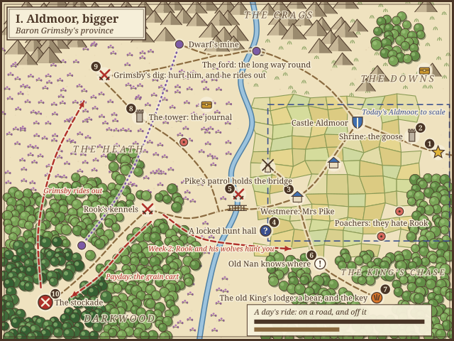

# Aldmoor, bigger

The first commission, rebuilt with room to ride. Artur picked these ideas on 29 Sep.

**Built (#77):** the space, the regions, the river with its bridge and ford, today's places in the new land, Mrs Pike
in Westmere, and Grimsby's dig on the heath (raiding it sets `flags.dig`).
**Built (#79):** the court that remembers what you did, the bounty paid with a scene, and the Courtier's parley at
Grimsby's walls: Old Nan's lullaby, for half the bounty.
**Built (#75):** Grimsby rides out to meet you when you raid his dig or take his patrol off the bridge, and flees home
when his guard is beaten.
**Built (#15):** Rook the Huntsman, Grimsby's captain, leads the wolves from the kennels, and hunts you from week 2.
**Built (#76):** the hunt hall by the bridge, Old Nan's word, the lodge in the chase with its bears, and the huntsmen.
**Still to build:** the grain cart (#78).

**Space.** About 2.5 times as wide and as tall as today's Aldmoor, roughly 100 by 75 tiles. Today a day's ride on a
road crosses the whole province; now it takes three. You start at the edge, on the King's road. The river is a
real barrier: Pike's patrol holds the bridge, and the ford in the north is the long way round.

**Grimsby's people move.**

- Grimsby rides out to meet you when you hurt him, for instance when you raid his dig. Beat him in the open and he
  flees home to his stockade.
- Rook the Huntsman, one of Grimsby's captains, leads the wolves, and hunts you from week 2.
- Every payday, Pike's patrol takes Westmere's grain to the stockade, and you can catch the cart on the road.

**Locked now, opened later.**

- The old King's hunt hall stands by the bridge, locked since he died. Old Nan knows where he kept the key: at his
  hunting lodge in the chase, past a bear. Open the hall, and the old King's huntsmen come back to it. They're
  veteran bowmen who join you for no wages, and Grimsby gave their job to Rook, so they have a score to settle.
- Mrs Pike in Westmere wants her boy home, and his father's journal in the tower sends him.
- Grimsby's men are digging on the heath for the old King's treasure, in the wrong place.

**The weeks.** In week 1 you explore the near side: the locked hall, the bridge you can't cross yet, and the key a
day's ride off. In week 2 you cross to the far side by the ford, and Grimsby's people start moving. Week 3 brings
Pike home and the stockade. Grimsby can be beaten around day 21, and in theory from day 1. Going the wrong way
costs a day or two, never the commission, so every direction has something worth the ride.

**The court** remembers what you did, and a boon can carry someone into the next commission.

**Kept as it is:** the goose and the hymn, the poachers and the venison, the tower's choice, the dwarf's delving,
Old Nan's charms, the butts and the mill.

Artur's rules in WORLD.md apply: hint, don't tell; heroes and captains fight but can't be touched; captains are the
enemy's; no gimmicks.
